[](https://a5c.ai)

> This entire codebase, product definition and everything in it was created entirely with the a5c.ai platform and 99% by AI agents.

# a5c AI Development Platform

<div align="center">

[](https://github.com/a5c-ai/seed-generic/generate)
[](https://a5c.readthedocs.io/en/latest/)
[](https://a5c.ai)

**Transform your repository into an intelligent development environment with AI agents**

*Work with specialized AI agents that handle tasks, review code, fix builds, and implement features through GitHub Issues and Pull Requests.*

</div>

---

## 🚀 Choose Your Path

<div align="center">

### 🆕 Starting a New Project?
**Use our pre-configured template repository**

[](https://github.com/a5c-ai/seed-generic/generate)

*Get started in minutes with a fully configured a5c environment*

---

### 📁 Have an Existing Project?
**Add a5c agents to your current repository**

</div>

#### Quick Setup for Existing Projects

> **Note:** These steps are for adding a5c to an existing repository. For new projects, use the template above.

1. **📋 Add Configuration Files to Your Existing Repository**
   
   **Create `.github/workflows/a5c.yml`:**
   ```yaml
   name: a5c AI Agents
   on:
     issues:
       types: [opened, edited]
     issue_comment:
       types: [created, edited]
     pull_request:
       types: [opened, edited, synchronize]
     pull_request_review_comment:
       types: [created, edited]
   
   jobs:
     a5c:
       runs-on: ubuntu-latest
       steps:
         - uses: actions/checkout@v4
         - name: Run a5c AI Agents
           uses: a5c-ai/agent-runner@v1
           with:
             github-token: ${{ secrets.GITHUB_TOKEN }}
             ai-provider: ${{ vars.A5C_CLI_TOOL }}
             openai-key: ${{ secrets.OPENAI_API_KEY }}
             anthropic-key: ${{ secrets.ANTHROPIC_API_KEY }}
             azure-key: ${{ secrets.AZURE_OPENAI_API_KEY }}
             azure-project: ${{ vars.AZURE_OPENAI_PROJECT_NAME }}
             gemini-key: ${{ secrets.GEMINI_API_KEY }}
   ```
   
   **Create `.a5c/config.yml`:**
   ```yaml
   version: "1.0"
   # Example user configuration for A5C Runner
   # This file overrides settings from the built-in default configuration
   # Uncomment and modify the sections you want to customize   
   
   # Override default settings
   # mcp_config_path: ".a5c/custom-mcps.json"
   
   # Override file processing settings
   # file_processing:
   #   include_patterns:
   #     - "src/**/*.ts"
   #     - "lib/**/*.js"
   #     - "**/*.md"
   #   exclude_patterns:
   #     - "node_modules/**"
   #     - "dist/**"
   #     - "*.test.*"
   remote_agents:
     enabled: true
     cache_timeout: 120  # 2 hours
     retry_attempts: 5
     retry_delay: 2000   # 2 seconds
     sources:
       individual:
         - uri: "https://raw.githubusercontent.com/a5c-ai/registry/main/agents/development/team-installer-agent.agent.md"
           alias: "team-installer-agent"
   # Override agent discovery settings
   # agent_discovery:
   #   enabled: true
   #   max_agents_in_context: 15
   #   include_same_directory: true
   
   # Override prompt URI settings
   # prompt_uri:
   #   cache_timeout: 120
   #   retry_attempts: 5
   #   retry_delay: 2000 
   ```

2. **🔧 Configure GitHub Permissions**
   
   **Settings → Actions → General:**
   - ✅ Select **"Read and write permissions"**
   - ✅ Check **"Allow GitHub Actions to create and approve pull requests"**
   
   **Settings → General:**
   - ✅ Enable **"Issues"**
   - ✅ Enable **"Actions"**

   **Organization Visibility** (if using GitHub organization):
   - ✅ If your repo is in an organization, make yourself a public member
   - ✅ Go to: `https://github.com/orgs/your-org-name/people`
   - ✅ Settings → Member privileges → Make yourself visible

3. **🔑 Add AI Provider Secrets**
   
   Go to **Settings → Secrets and variables → Actions** and add:
   
   | Provider | Secret | Variable |
   |----------|--------|----------|
   | **OpenAI** | `OPENAI_API_KEY` | `A5C_CLI_TOOL=codex` |
   | **Claude** | `ANTHROPIC_API_KEY` | `A5C_CLI_TOOL=claude` |
   | **Azure OpenAI** | `AZURE_OPENAI_API_KEY` | `A5C_CLI_TOOL=azure_codex` |
   | **Gemini** | `GEMINI_API_KEY` | `A5C_CLI_TOOL=gemini` |

4. **🎯 Activate Your Team**
   
   # Important - in the Issues and PRs, the "@" sign has to be attached to the name of the agent
   for example: 
   ```markdown
   @agent-name
   ```

   Create these initial issues:
   ```markdown
   # Issue 1: Seed the Project
   @ project-seeder-agent start, the initial description is in the project description.
   ```
   
   ```markdown
   # Issue 2: Install Team
   @ team-installer-agent Install all the relevant missing agent from the registry.
   ```

---

## 🤖 Your AI Development Team

| Agent | Purpose | Example Usage |
|-------|---------|---------------|
| 🏗️ **team-installer-agent** | Installs & configures new agents | `@ team-installer-agent add security-reviewer` |
| 👨‍💻 **developer-agent** | Feature development & coding | `@ developer-agent add user authentication` |
| 🎯 **producer-agent** | Project coordination & planning | `@ producer-agent create project roadmap` |
| ✅ **validator-agent** | Code quality & testing | `@ validator-agent review this PR` |
| 🔧 **build-fixer-agent** | CI/CD & build issues | `@ build-fixer-agent fix failing tests` |
| 📝 **content-writer-agent** | Documentation & content | `@ content-writer-agent update API docs` |
| 🤝 **conflict-resolver-agent** | Merge conflicts & disputes | `@ conflict-resolver-agent resolve conflicts` |
| ☁️ **azure-sre-engineer-agent** | Infrastructure & DevOps | `@ azure-sre-engineer-agent setup CI pipeline` |

---

## 🔄 How It Works

```mermaid
graph LR
    A[📝 Create Issue] --> B[🏷️ Tag Agent]
    B --> C[🤖 Agent Analyzes]
    C --> D[📤 Creates PR]
    D --> E[👀 You Review]
    E --> F[✅ Merge]
    E --> G[💬 Request Changes]
    G --> C
```



1. **📝 Create Issues** - Describe what you need in plain English
2. **🏷️ Tag Agents** - Use `@agent-name` to assign specialized agents
3. **🤖 AI Analysis** - Agents analyze your codebase and requirements
4. **📤 Pull Requests** - Agents create PRs with implementations
5. **👀 Review & Iterate** - Collaborate with agents through PR comments
6. **✅ Deploy** - Merge when ready, agents handle the rest

---

## 💡 Example Workflows

### Add a New Feature
```markdown
@ developer-agent

Create a user authentication system with:
- Email/password login
- JWT tokens for session management
- Password reset functionality
- Protected routes middleware

Follow security best practices and add comprehensive tests.
```

### Fix a Build Issue
```markdown
@ build-fixer-agent

The CI pipeline is failing on the `test:integration` step. 
The error mentions database connection issues in the test environment.
Please investigate and fix the test configuration.
```

### Create Documentation
```markdown
@ content-writer-agent

Create API documentation for the user management endpoints in `/src/api/users/`.
Include request/response examples, error codes, and authentication requirements.
Format as OpenAPI/Swagger specification.
```

---

## ⚡ What to Expect

- **First Setup**: 2-5 minutes for agents to initialize
- **Issue Response**: 1-5 minutes for agent acknowledgment
- **PR Creation**: 5-30 minutes depending on task complexity
- **Iteration Speed**: Near-instant responses to feedback

---

## 💰 Cost Awareness

Complex projects may cost $20-50. Set usage limits in your AI provider dashboard.

---

## 🔧 Troubleshooting

### Agents Not Responding?

1. Check GitHub Actions permissions (most common issue)
2. Verify AI provider API key is set correctly
3. Ensure "Issues" and "Actions" are enabled
4. Check organization visibility (if using GitHub org)
5. Manually trigger agent activation by commenting on the issue or ticket:
   ```markdown
   @ team-installer-agent please assemble team.
   ```
   or
   ```markdown
   @ developer-agent do it.
   ```

### High API Costs?
- Set usage limits in your AI provider dashboard
- Use more specific issue descriptions to reduce iteration
- Review and approve PRs promptly to avoid re-work

### Build Failures?
- Tag `@ build-fixer-agent` in the failing PR or create a new issue
- Check Actions tab for detailed error logs
- Agents will automatically retry failed builds

---

## 📚 Resources

<div align="center">

[](https://a5c.readthedocs.io/en/latest/)
[](https://github.com/a5c-ai/registry)
[](https://a5c.ai)

</div>

---

## 🤝 Contributing

This template is part of the a5c ecosystem. To contribute:
1. Fork this repository
2. Make your improvements
3. Submit a pull request
4. Agents will help review and integrate your changes!

---

<div align="center">

## 🎉 Welcome to the Future of Development

**Your repository is now *alive***

Issues become tasks • Pull requests become conversations • Code becomes collaborative

### 🚀 Ready to Start?

**[Create your first issue and tag an agent!](../../issues/new)**

---

*Built with ❤️ by the a5c community*

</div>
